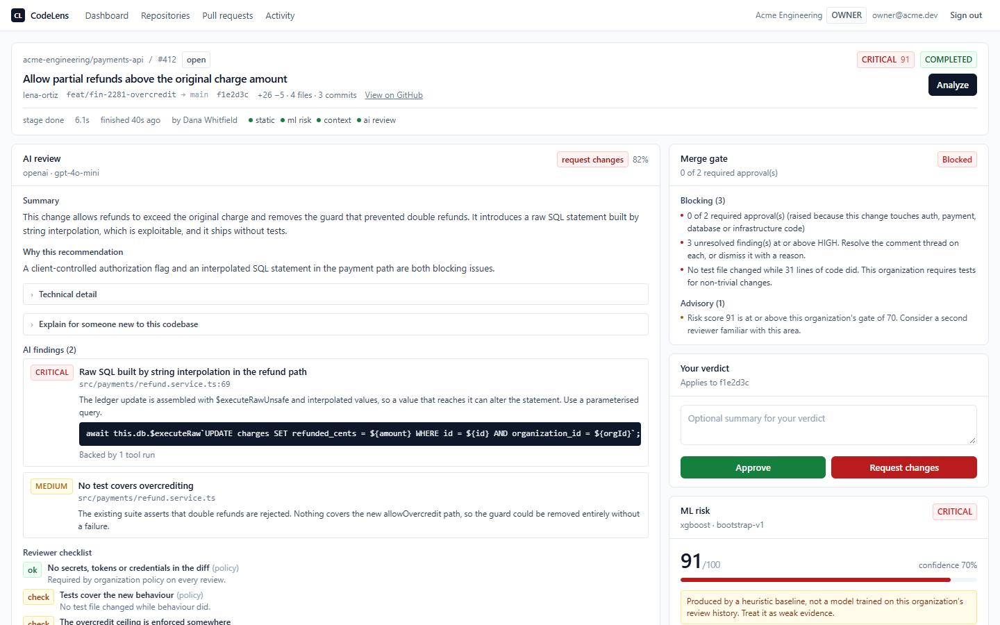
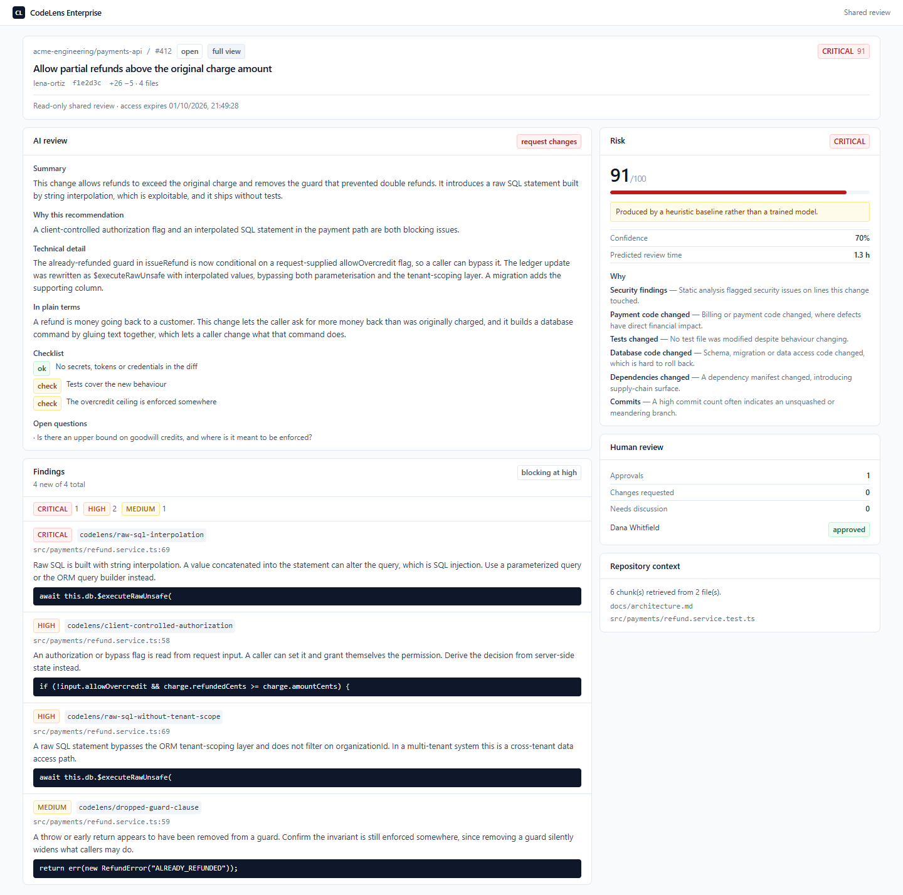
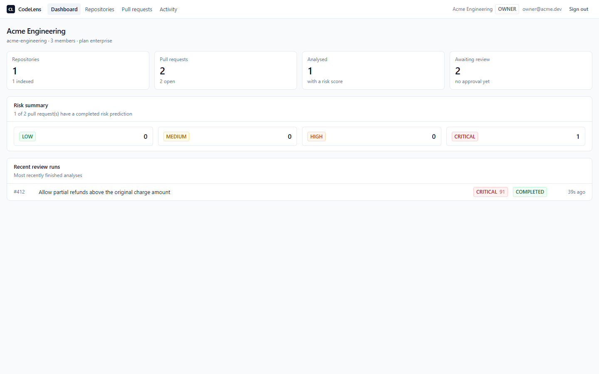
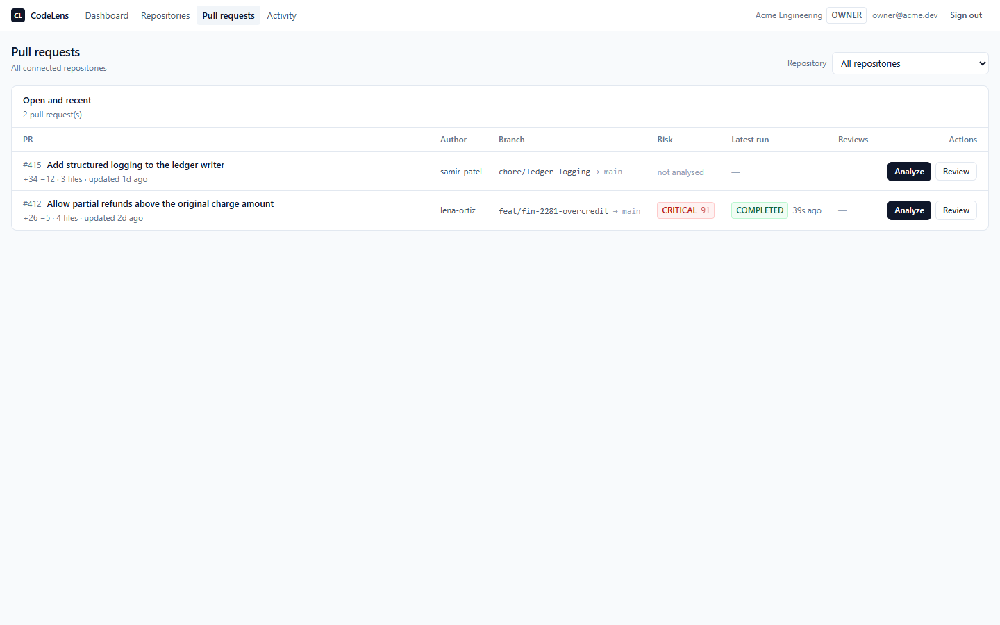
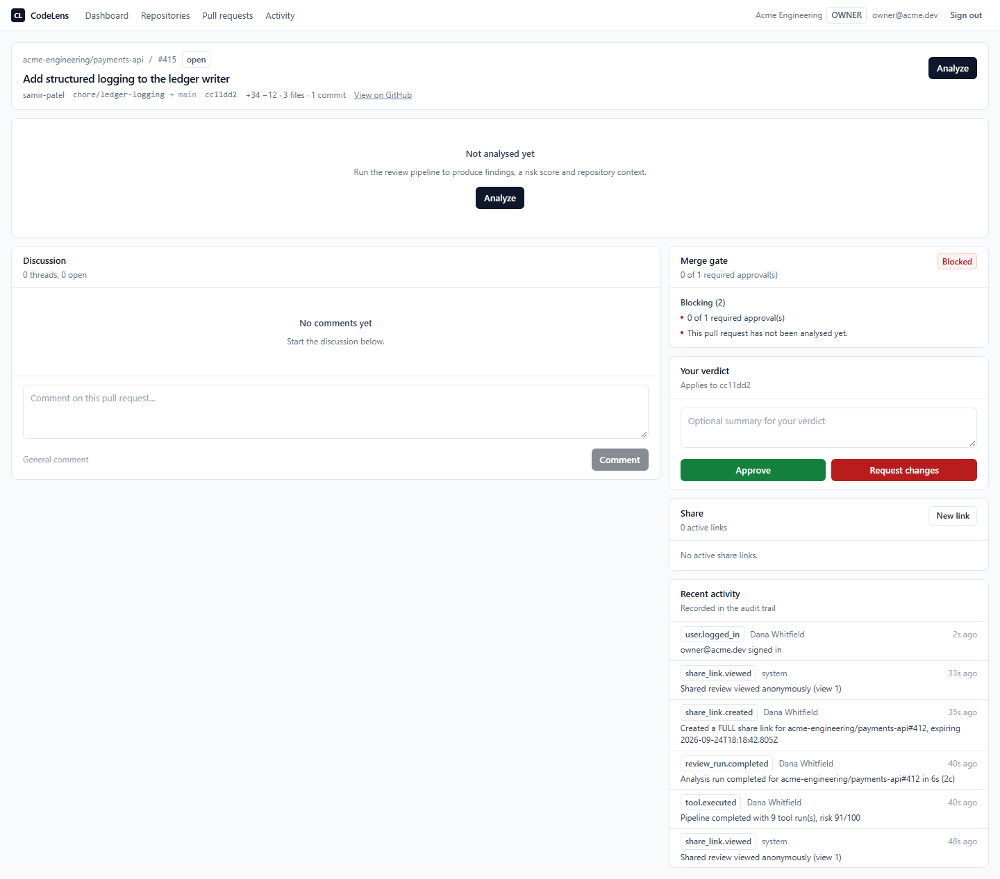
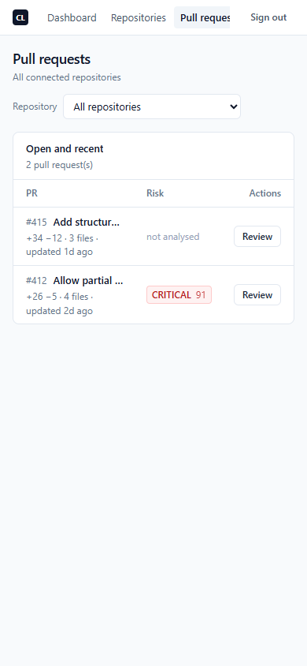
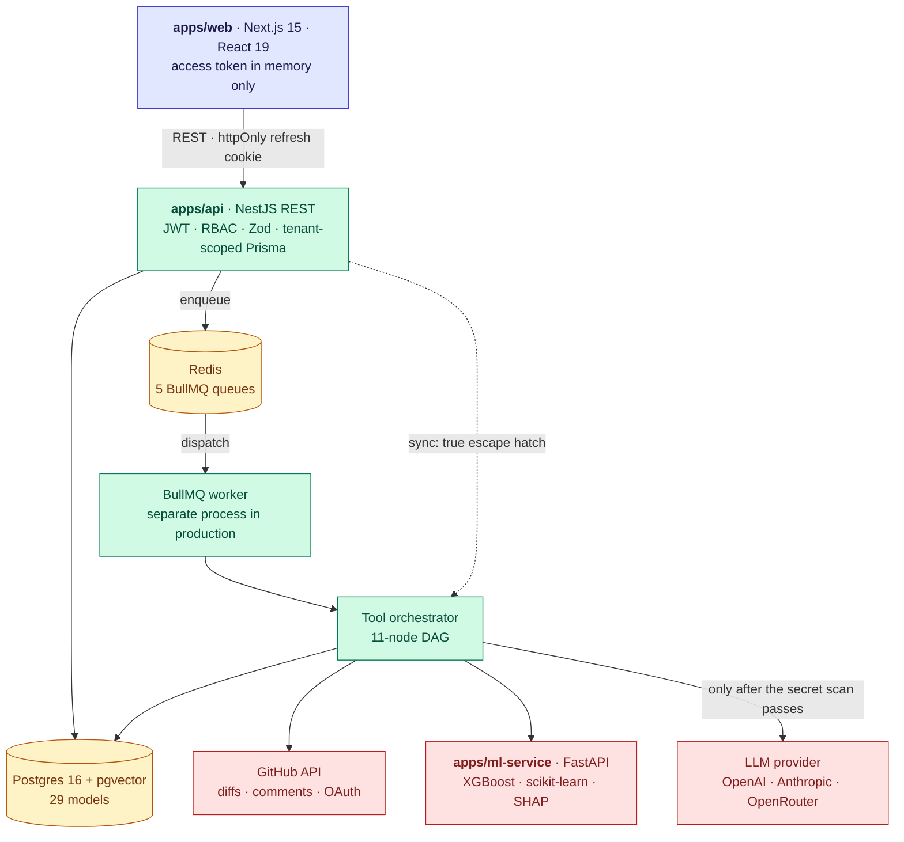

# CodeLens Enterprise

**AI + ML assisted code review for GitHub pull requests.** A reviewer opens a pull request and gets
a risk score with reasons, static-analysis findings anchored to real lines, the repository context
the change actually touches, and an AI narrative that is only allowed to cite evidence the pipeline
produced. Then they approve or request changes against a policy-driven merge gate.

Built as a full-stack systems project: a pnpm monorepo with a NestJS API, a Next.js review
workspace, a Python FastAPI ML service, and six shared TypeScript packages. ~30,000 lines of
TypeScript, ~2,400 lines of Python, 29 Prisma models, 11 orchestrated analysis tools.

> **This is not an OpenAI API wrapper.** Four independent evidence sources are assembled *before*
> any language model is involved, and the model's output is schema-validated, evidence-filtered and
> policy-reconciled afterwards. With no provider key configured at all, the product still produces
> findings, a risk score, retrieved context and a merge gate — it degrades the AI stage and says so.
> [Why that distinction matters →](docs/interview-notes.md#1-why-is-this-not-just-an-openai-api-wrapper)

---

## Screenshots

### The review workspace

Merge gate first, then the verdict controls that act on it, then the evidence that explains it.
Risk `91 CRITICAL`, three blocking reasons, one advisory.



### Read-only shared review

A time-limited external link. Served from an allowlisted payload, not the workspace with fields
deleted — no provider, model, token usage, cost, tool outputs, comments or user ids.



### Dashboard, pull request list, and the honest empty state

| | |
| --- | --- |
|  |  |
|  |  |

Bottom left is PR #415, seeded un-analysed on purpose so the "not analysed yet" state is
demonstrable. Bottom right is the same list at 390px, where risk and the review action stay
reachable.

---

## Architecture



The web app never talks to GitHub, the ML service or an LLM directly. All orchestration, RBAC,
quota and audit enforcement lives in the API, so there is exactly one place where a tenant boundary
can be got wrong.

**More diagrams:** [the 11-tool analysis DAG, the queue/polling model, and the evidence-filter
pipeline →](docs/architecture.md)

### Monorepo layout

```
apps/
  web/                 Next.js App Router frontend — the demo flow, 8 routes
  api/                 NestJS REST API + BullMQ workers + tool orchestrator
  ml-service/          Python FastAPI — risk, review time, neighbours, clustering
packages/
  shared/              Zod contracts, DTO types, enums, the cross-language feature schema
  database/            Prisma schema (29 models), client, seed, demo reset
  github/              Octokit client, unified-diff parser, rate limiting
  static-analysis/     ESLint / Semgrep / npm-audit / pattern-scan / secret-scan + ML features
  rag-engine/          AST chunker, embedder, pgvector store, hybrid retriever
  ai-agent/            MCP-style tool registry, orchestrator, prompts, provider adapters
infra/
  postgres/init.sql    pgvector + pg_trgm
  semgrep/rules/       organization-specific rules
```

---

## Tech stack

| Layer | Choices |
| --- | --- |
| **Frontend** | Next.js 15 (App Router), React 19, TypeScript 5.7, Tailwind 3.4, TanStack Query |
| **Backend** | NestJS 11, Zod 3, Prisma 6, BullMQ 5, Passport JWT, Swagger |
| **Data** | Postgres 16 + pgvector + pg_trgm, Redis 7 |
| **ML** | Python 3.12, FastAPI, scikit-learn, XGBoost, SHAP, pandas, NumPy |
| **Static analysis** | ESLint, Semgrep, `npm audit`, plus two in-process analyzers |
| **AI** | OpenAI / Anthropic / OpenRouter adapters behind one provider interface |
| **Tooling** | pnpm workspaces, Docker Compose, Vitest, Playwright, GitHub Actions |

---

## Features

**Analysis pipeline.** 11 tools in a dependency-ordered DAG, each recorded as a `ToolRun` with
status, duration, token usage, cost and cache-hit state. Every finding in the UI is traceable to
the tool run that produced it.

**ML risk engine.** Calibrated 0–100 risk score with SHAP-attributed reasons, review-time estimate
with a prediction interval, nearest historical pull requests with their outcomes, and issue
clustering over the organization's own finding text.

**RAG repository context.** AST-aware chunking, pgvector similarity plus three non-vector retrieval
strategies, and a viewer that shows *which strategies agreed* on each chunk rather than a bare
cosine distance.

**Review workspace.** Policy-driven merge gate, human verdicts scoped to a commit SHA, threaded
comments anchored to findings — resolving a finding-linked thread clears that finding from the gate,
so a human overrides an analyzer visibly and with their name on it.

**Sharing and audit.** Time-limited external share links with an allowlisted payload. Append-only
audit trail; share tokens never appear in it.

**Multi-tenancy and RBAC.** Four roles, `organizationId` scoping enforced by Prisma middleware
rather than by remembering a `where` clause, AES-256-GCM encryption for stored GitHub tokens.

**Queues.** Analysis, indexing, GitHub sync, comment publishing and model retraining are all
queued with progress polling, so a multi-minute analysis never blocks request handling.

---

## AI / ML components

### The four evidence layers

| Layer | Contributes | Determinism |
| --- | --- | --- |
| **Static analysis** | ESLint, Semgrep, `npm audit`, pattern-scan and secret-scan findings, scoped to the diff | fully deterministic |
| **ML risk engine** | calibrated score, review-time estimate, similar historical PRs, SHAP reasons | reproducible per model version |
| **RAG context** | the architecture docs, conventions, contracts and tests the change actually touches | reproducible per index version |
| **AI agent** | prioritization, explanation, suggested fixes and tests — grounded in the three above | schema-validated, evidence-filtered |

The language model ranks and explains evidence. It does not create it. A SECURITY or CRITICAL
finding that arrives without a valid backing `ToolRun` id is **dropped during validation**, and the
drop is counted in `droppedFindingCount`.

### Models

Seven model families, trained in eight steps by `apps/ml-service/scripts/train.py`, compared and
selected on measured metrics rather than preference:

| Model | Task |
| --- | --- |
| XGBoost + isotonic `CalibratedClassifierCV` | risk classification — the production model |
| Logistic regression | baseline in the same comparison table |
| Random forest | baseline in the same comparison table |
| RidgeCV on `log1p(minutes)` | review-time estimate, interval from the residual sigma |
| k-nearest neighbours over the transformed feature space | similar historical pull requests |
| KMeans over TF-IDF finding text | recurring issue patterns |
| LinearSVC | issue-type classification |

The eighth step is a bagging-versus-boosting experiment whose comparison table is **exposed through
the API**, not left in a notebook. An enterprise buyer asking "why XGBoost" deserves the measured
answer rather than an assertion.

13 numeric features plus two text features (`title_text`, `commit_text`), with the feature list and
ordering mirrored between `packages/shared/src/ml-features.ts` and
`apps/ml-service/app/features.py`. A parity test fails the build if they drift.

### Honest framing of the bootstrap model

With no labelled review history, the service trains on a **synthetic** dataset whose labelling rule
is written out explicitly in `scripts/generate_dataset.py`. Those artifacts are tagged
`is_baseline=True`, confidence is capped at 0.70, and the UI says so on the risk panel:
*"Produced by a heuristic baseline, not a model trained on this organization's review history.
Treat it as weak evidence."*

Measured on that synthetic data during development: ROC AUC 0.854, 5-fold CV 0.805 ± 0.017,
Brier 0.120, review-time median error 4.7 min. **These are metrics on a synthetic label function,
not a claim about real pull requests.** Scores order sensibly — a tested typo fix ~10, an untested
auth bypass ~72, a payment change with two critical findings ~90 — but the distribution is bimodal:
genuinely mid-risk changes land in HIGH rather than MEDIUM. Per-organization retraining on real
human verdicts is implemented and kicks in at 200 labelled pull requests; it has never run on real
data.

---

## Quick start

### Prerequisites

- Node.js 20+, pnpm 9+
- Docker Desktop (Postgres + Redis)
- Python 3.11 or 3.12 — only if running the ML service outside Docker

> Use 3.11 or 3.12 specifically. On 3.13+ there are no prebuilt wheels for scikit-learn, NumPy and
> XGBoost at these pinned versions, so pip compiles from source and fails without a full C/C++
> toolchain. The Docker image pins `python:3.12-slim` for exactly this reason.

### 1. Install and configure

```bash
pnpm install
cp .env.example .env          # Windows: Copy-Item .env.example .env
```

Generate real secrets:

```bash
node -e "console.log('JWT_SECRET=' + require('crypto').randomBytes(48).toString('hex'))"
node -e "console.log('JWT_REFRESH_SECRET=' + require('crypto').randomBytes(48).toString('hex'))"
node -e "console.log('ENCRYPTION_KEY=' + require('crypto').randomBytes(32).toString('hex'))"
```

`ENCRYPTION_KEY` must be exactly 64 hex characters — it is the AES-256-GCM key for stored GitHub
tokens. The API refuses to boot if it is missing or the wrong length.

### 2. Infrastructure and demo data

```bash
pnpm docker:up          # postgres + redis
pnpm db:push            # apply the Prisma schema
pnpm db:seed            # demo org, users, policy, PR #412 and #415
```

### 3. Run

```bash
pnpm dev                # web :3000 + api :4000
docker compose up -d ml-service   # optional; risk degrades gracefully without it
```

| Service | URL |
| --- | --- |
| Web | http://localhost:3000 |
| API | http://localhost:4000/api/v1 |
| Swagger | http://localhost:4000/docs |
| ML service | http://localhost:8000/docs |

### Demo credentials

Seeded, local-only, deliberately committed. All three share the password `CodeLensDemo2026`:

| Email | Role | Use it to see |
| --- | --- | --- |
| `owner@acme.dev` | OWNER | everything, including share-link creation |
| `reviewer@acme.dev` | REVIEWER | approve / request changes, comment moderation |
| `dev@acme.dev` | DEVELOPER | **approval blocked — they authored PR #412** |

Sign in as `dev@acme.dev` to see the merge gate explain *why* the approve button is unavailable
rather than leaving a greyed-out control.

### The demo flow

**Dashboard → Repositories → `acme-engineering/payments-api` → PR #412 → Review.**

PR #412, *"Allow partial refunds above the original charge amount"*, is a deliberately dangerous
change: `+26 −5` across 4 files, **31 changed lines**, no test file touched. The live pattern scan
produces **4 findings**, each anchored to the line its snippet is actually on:

| Severity | Location | Rule |
| --- | --- | --- |
| `CRITICAL` | `refund.service.ts:69` | raw SQL built by string interpolation |
| `HIGH` | `refund.service.ts:69` | raw SQL bypasses tenant scoping |
| `HIGH` | `refund.service.ts:58` | authorization flag read from request input |
| `MEDIUM` | `refund.service.ts:59` | guard clause removed |

Risk `91 / CRITICAL`. The gate blocks on three reasons, one of which is *"No test file changed
while 31 lines of code did."*

### Resetting between demos

```bash
pnpm db:reset-demo
```

Every demo adds comments, verdicts and share links to the same pull request. After a dozen passes
the Discussion panel measured 2544px tall and the Share panel 1747px, burying the AI review and the
merge gate under noise the product did not generate. This clears the collaboration layer and prunes
runs to the newest *completed* one per pull request, keeping the workspace demo-ready. Audit
entries are deliberately left alone — the trail is append-only by design, and the panels are
bounded instead.

---

## Verification

There is no CI badge here because the interesting verification is not unit tests. **434 assertions**
across six suites, most of which exist because they caught something.

```bash
pnpm -r --if-present typecheck                      # 8 packages
pnpm --filter @codelens/static-analysis test        #  11 — analyzer line anchoring
pnpm --filter @codelens/ai-agent test               #  15 — AI failure classification
pwsh -File apps/api/test/verify-ai-review.ps1       # 157 — AI path incl. 7 provider failure modes
pwsh -File apps/api/test/verify-review-sessions.ps1 #  87 — workspace, gate, comments, sharing
pwsh -File apps/web/test/verify-web-flow.ps1        #  84 — every API contract the screens read
node apps/web/test/browser-walkthrough.mjs          #  80 — real Chrome, real clicks
```

The browser walkthrough drives system Chrome through Playwright: signs in, walks the demo flow,
creates a comment, submits both verdicts, creates and opens a share link, checks tablet and mobile
layouts. Alongside the functional assertions it audits every page for document overflow, elements
wider than their container and clipped text, and fails on any unexpected console error. It writes
screenshots and a `report.json`.

The AI path is verified against a local provider double that speaks the OpenAI wire format, so the
real adapter, retry logic, JSON extraction, Zod validation, repair loop, evidence filter and
persistence all execute unchanged. That matters because the failure modes worth testing — a
rejected key, a non-JSON response, schema-valid-but-wrong shape, fabricated evidence ids, a model
recommending approval of a CRITICAL change — cannot be produced on demand from a real provider.

### Bugs found by running it

A representative selection. The full list with root causes is in
[the interview notes](docs/interview-notes.md#6-what-bugs-did-verification-actually-find).

- **Credentials in the URL.** The sign-in form submitted as a GET before React hydrated, so a
  submit during page load navigated to `/signin?email=…&password=…` — password in the URL, in
  history, and in any access log.
- **The secret scanner silently found nothing.** It indexed diff-reconstructed content *by*
  absolute line number, so for a hunk starting at line 55 every lookup ran past the end of a
  13-element array. It reported success on every file whose content came from a diff, which is the
  normal case.
- **Findings pointed at the wrong lines.** `pattern-scan` resolved a line as
  `touchedLines[findings.length]` — a global finding counter — so a SQL-injection finding landed
  three lines above the call it described, and a finding in one file renumbered findings in the next.
- **Review-time regression with R² = −286**, dramatically worse than predicting the mean. Ordinary
  least squares was underdetermined — ~6000 transformed columns against ~4800 training rows — so it
  fit the training set exactly and the predictions exploded after `expm1`. Found by reading
  `model_report.json` instead of assuming training success.
- **XGBoost learned almost nothing from the code.** Raw TF-IDF produced ~6000 text columns against
  20 numeric features, and with `colsample_bytree` most candidate splits were text tokens.
- **A share token leaked into an error body and the logs**, via an un-redacted request path.
- **Findings ordered MEDIUM above CRITICAL** on the shared page — Prisma orders enums by
  declaration position, so `severity: 'desc'` returns INFO first.
- **BullMQ silently rejects `:` in job ids**, which is exactly the separator a natural
  `orgId:prId:sha` idempotency key uses.
- **Mobile tables hid the primary action** while the document reported zero horizontal overflow,
  because the table scrolled inside its own container.

---

## Limitations

Stated plainly, because a portfolio project that claims to be finished is not credible.

**Never verified**

- **No real LLM inference has ever run.** No provider key is configured. The AI path is verified
  structurally against a wire-format double; whether a real model writes a *good* review is a
  human judgement that has not been made.
- **Per-organization model retraining** is implemented but has never run on real labels.
- **Only Chrome** was exercised in browser QA. No other engine, and no screen-reader testing.
- **No formal security review or penetration test.** Tenant isolation is enforced and asserted, not
  audited.

**Known-weak by construction**

- ML models are trained on synthetic data. The quoted metrics describe a synthetic label function.
- Semgrep needs syntactically valid files, and a diff hunk usually is not one — measured: it ran
  over four files and matched none. That is why the in-process `pattern-scan` exists as a floor.
- `npm audit` needs npm on PATH and ESLint needs the target repo to have a config; both report
  `NOT_INSTALLED` / `SKIPPED` rather than pretending.
- The demo runs against seeded diff fixtures. The GitHub client, OAuth, webhook verification and
  diff parsing are real code, but the demo path does not hit github.com.

**Deliberately not built**

No settings, billing, onboarding, analytics charts, landing page or in-app diff viewer. The MVP is
one flow end to end; each of those would be a second one.

---

## Documentation

| Document | Contents |
| --- | --- |
| [docs/architecture.md](docs/architecture.md) | analysis DAG, queue model, evidence-filter pipeline, data model |
| [docs/portfolio.md](docs/portfolio.md) | resume bullets, 30-second pitch, demo script, technical walkthrough |
| [docs/interview-notes.md](docs/interview-notes.md) | the hard questions, answered with specifics |
| [apps/api/README.md](apps/api/README.md) | AI review contract, job model, backend harnesses |
| [apps/web/README.md](apps/web/README.md) | auth model, what the UI refuses to render, browser QA |
