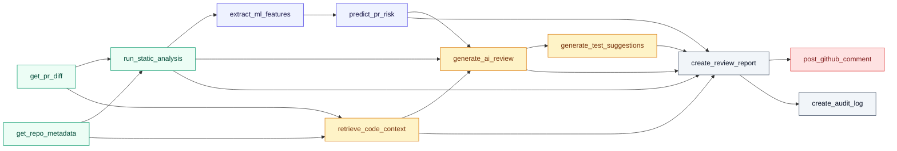
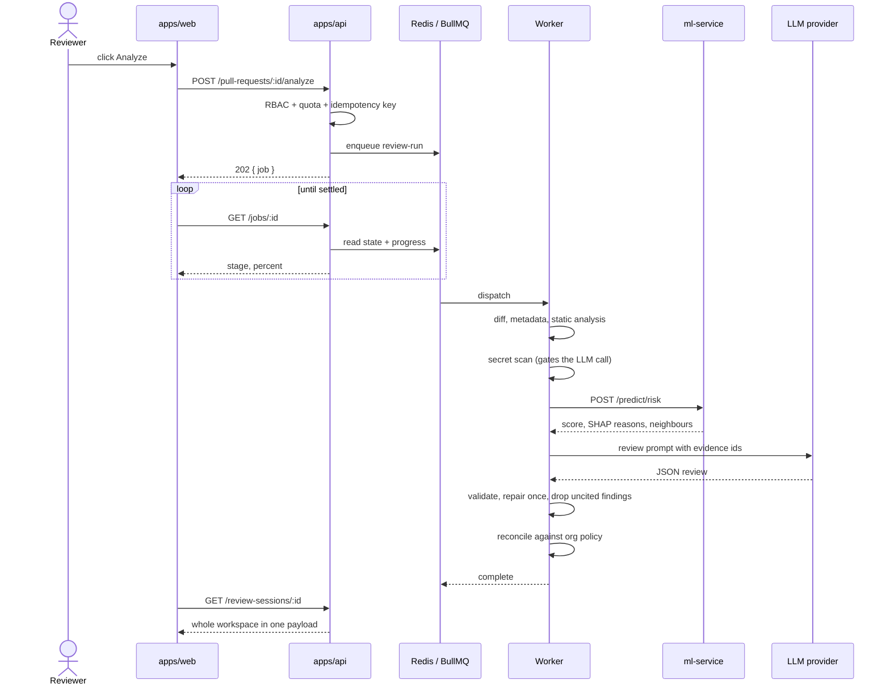
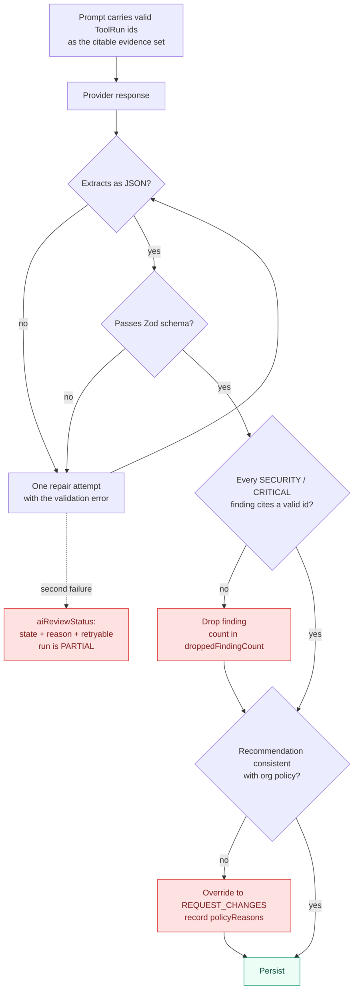
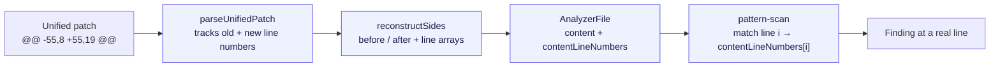
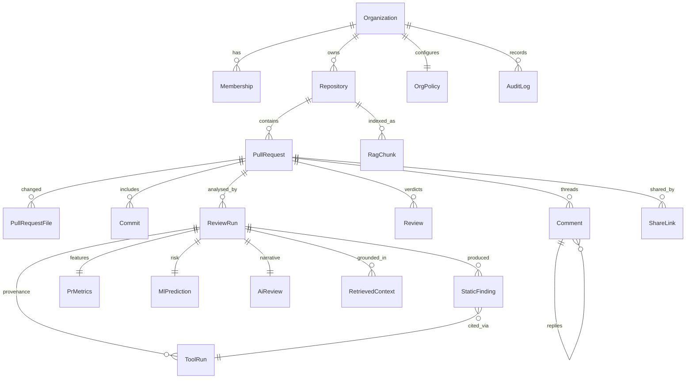

# Architecture

Diagrams and the reasoning behind the structural choices. The system diagram is in
[the README](../README.md#architecture); this file covers the pipeline, the queue model, the
evidence filter and the data model.

---

## The analysis DAG

Eleven tools, dependency-ordered. The orchestrator resolves the order from declared dependencies
rather than a hardcoded list, which is what caught the ordering bug described below.

Green is deterministic, blue is ML, amber is generative, red is the only node with external write
access. Every node is persisted as a `ToolRun` carrying status, sequence, duration, cache-hit state,
token usage, cost and a redacted error. The UI's provenance panel is a direct rendering of that
table.

**Degradation is per-node, not per-run.** A run whose `generate_ai_review` fails is `PARTIAL`, not
`FAILED`: static findings, risk, context and the merge gate are all still there, and the workspace
shows a classified reason for the gap rather than an empty panel.

**The bug this structure exposed.** The first full run produced a report *before* the risk
prediction it was supposed to contain, because `create_review_report` did not declare its
dependency on `predict_pr_risk`. The report persisted successfully with a null risk score, so
nothing failed — it just produced a review with no risk in it. Declaring the edge fixed it; the
lesson is that the DAG has to be the source of truth rather than the insertion order of a list.

---

## Request and queue model

Three managed queues: `review-run`, `repo-index`, `pr-sync`.
`github-publish` and `model-retrain` are reserved constants, not registered consumers.

**Why queued.** A full analysis takes tens of seconds and involves subprocesses, an HTTP call to
Python and an LLM round trip. Run inline it competes with request handling for the event loop. In
development `RUN_WORKERS_IN_API=true` keeps it to one process; in production the worker runs
separately.

**Why the workspace is one request.** `GET /review-sessions/:id` returns the pull request, latest
run, risk, findings, retrieved context, tool provenance, verdicts, threads, share links and the
caller's permissions together. Fetching those separately would make the page assemble itself in
visible stages, with the merge gate — the most decision-relevant part — arriving last.

**Four queue bugs found by running it:**

- BullMQ silently rejects `:` in job ids, which is exactly the separator a natural
  `orgId:prId:sha` idempotency key uses.
- `getWorkers()` is unreliable as a liveness probe; health had to be derived differently.
- An env override in `worker.ts` was dead code — the config module had already been evaluated.
- Redis configured with `allkeys-lru` can evict queue state under memory pressure, turning a
  pending job into one that never existed.

---

## The evidence filter

The step that makes the difference between "grounded" and "plausible".

A model that invents a `ToolRun` id to make a finding look backed loses the finding, not the
benefit of the doubt. A model that recommends APPROVE on a change with a CRITICAL finding gets
overridden, and the override is shown with its reasons rather than applied silently.

Provider failures are classified rather than collapsed into "AI failed". Seven are asserted
individually in the harness, each with its own `aiReviewStatus.reason` and a correct `retryable`
flag — rejected key and context-too-long are *not* retryable, rate-limited and provider-down are —
plus a hang, handled by timeout:

| Scenario | State | Retryable |
| --- | --- | --- |
| `unauthorized` — key rejected | FAILED | no |
| `model-not-found` | FAILED | no |
| `rate-limited` | FAILED | yes |
| `provider-down` — 503 | FAILED | yes |
| `context-too-long` | FAILED | no |
| `malformed` — not JSON | FAILED | no |
| `schema-invalid` — JSON, wrong shape | FAILED | no |

Three bugs here were found by testing those paths: the provider's response body (which echoes
prompt content and key fragments) leaking into `ToolRun.error`; a missing degradation reason, which
is why `aiReviewStatus` exists at all; and unparseable responses being misclassified as schema
failures, which sent them into a pointless repair loop.

---

## Static analysis: the line-anchoring problem

Reviewing a pull request means reconstructing file content from diff hunks. That content is a
**fragment** — index 0 is wherever the first hunk starts, not line 1 of the file.

`parseUnifiedPatch` always tracked the numbers; `reconstructSides` threw them away and returned
bare strings. Analyzers could match a line but not say which line they matched, and `pattern-scan`
filled the gap with `touchedLines[findings.length]` — the touched-line set indexed by a *global
finding counter*. That was wrong in three independent ways: the counter is unrelated to the matched
line, it kept incrementing across file boundaries so a finding in one file renumbered findings in
the next, and two rules matching one line got different numbers.

`contentLineNumbers` is a plain number array rather than a richer line object, because
`packages/static-analysis` deliberately does not depend on `@codelens/github` and position is all an
analyzer needs. Absent mapping means content is a whole file, where `index + 1` is already correct;
an unmappable line yields a file-level finding rather than a number that happened to be reachable.

Fixing it surfaced two more problems. The **secret scanner** had the same root cause and was failing
closed: it indexed the fragment *by* new-file line number, so for a hunk starting at 55 every lookup
ran past the end of a 13-element array, and it silently found nothing on every file whose content
came from a diff. And **dedupe**, keyed on `path:line:category`, began collapsing the two raw-SQL
rules that now correctly landed on the same line — dropping the missing-tenant-filter finding.
Switching to a parameterized query fixes the injection and leaves the cross-tenant read, so those
are two defects; dedupe now collapses only across analyzers, which is what its own comment always
said it was for.

---

## Data model

29 Prisma models. The parts that shape everything else:

Three decisions worth naming:

**`organizationId` on every tenant-owned row, enforced by Prisma middleware.** Not by remembering a
`where` clause. A forgotten filter is a cross-tenant leak, and the one place to stop that is below
the query layer.

**`PrMetrics` is persisted, not recomputed.** It is the feature vector the model actually saw. A
risk score you cannot reproduce is not auditable, and retraining needs the historical features, not
today's re-derivation of them.

**Human verdicts write ML training labels.** `Review` submission sets `wasRisky`,
`firstReviewedAt` and `actualReviewMinutes` on the pull request, which is how the risk model
improves from review outcomes instead of staying frozen at bootstrap weights.

`Comment` self-relation carries the finding anchor (`path`, `line`, `findingFingerprint`,
`ruleId`). Resolving a finding-linked thread clears that finding from the merge gate — the
mechanism by which a human overrides an analyzer visibly, with their name attached, rather than by
suppressing a rule.
